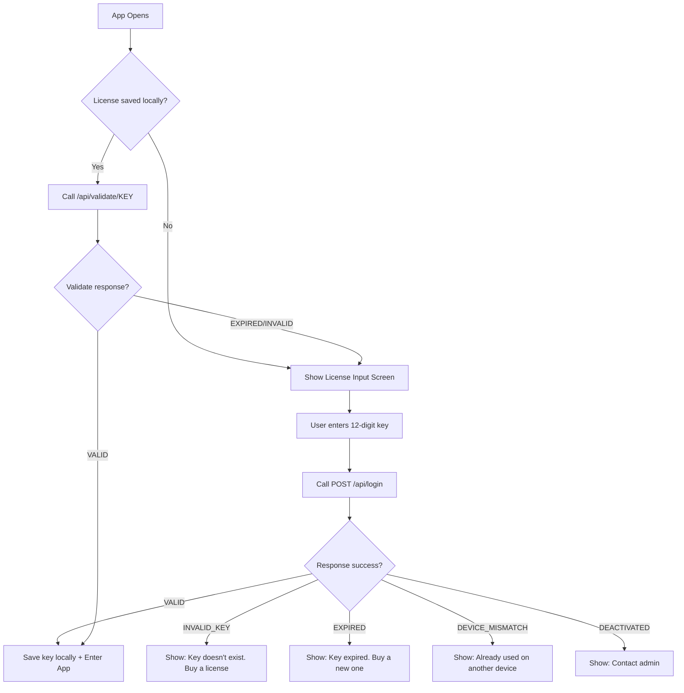

# CoupenApp ↔ CoupenAdmin Integration Guide

## Architecture Flow

```
┌─────────────────┐         ┌──────────────────────┐         ┌──────────┐
│   CoupenApp     │  REST   │   CoupenAdmin        │   JPA   │  MySQL   │
│   (Android)     │ ──────► │   (Spring Boot)      │ ──────► │  (Aiven) │
│                 │  JSON   │   localhost:9090      │         │          │
└─────────────────┘         └──────────────────────┘         └──────────┘
```

## User Flow



---

## API Endpoints

### 1. `POST /api/login` — First-time activation
**Request:**
```json
{
  "licenseKey": "ABC123DEF456",
  "androidId": "a1b2c3d4e5f67890",
  "userName": "Aditya"
}
```

**Success Response:**
```json
{
  "success": true,
  "status": "VALID",
  "message": "Welcome! Your license is active.",
  "expiryDate": "2027-01-01",
  "daysRemaining": 312,
  "userName": "Aditya"
}
```

**Error Responses:**
| status | message | When |
|--------|---------|------|
| `INVALID_KEY` | Key doesn't exist | Wrong key entered |
| `EXPIRED` | Expired on {date} | Past expiry date |
| `DEACTIVATED` | Deactivated by admin | Admin disabled it |
| `DEVICE_MISMATCH` | Registered on another device | Different android ID |

### 2. `GET /api/validate/{licenseKey}` — Startup check
Quick check, no body needed. Same response format.

---

## Android Integration Code

### Step 1: Add Internet Permission
**`AndroidManifest.xml`**
```xml
<uses-permission android:name="android.permission.INTERNET" />
```

### Step 2: Create `LicenseManager.java`
```java
package com.coupenapp;

import android.content.Context;
import android.content.SharedPreferences;
import android.os.Handler;
import android.os.Looper;
import android.provider.Settings;

import org.json.JSONObject;

import java.io.OutputStream;
import java.io.InputStream;
import java.net.HttpURLConnection;
import java.net.URL;
import java.nio.charset.StandardCharsets;
import java.util.Scanner;
import java.util.concurrent.ExecutorService;
import java.util.concurrent.Executors;

public class LicenseManager {

    // ⚠️ CHANGE THIS to your server IP/domain
    private static final String BASE_URL = "http://YOUR_SERVER_IP:9090";

    private static final String PREF_NAME = "coupen_license";
    private static final String KEY_LICENSE = "license_key";
    private static final String KEY_EXPIRY = "expiry_date";

    private final Context context;
    private final SharedPreferences prefs;
    private final ExecutorService executor = Executors.newSingleThreadExecutor();
    private final Handler mainHandler = new Handler(Looper.getMainLooper());

    public interface LicenseCallback {
        void onSuccess(String message, String expiryDate, long daysRemaining);
        void onError(String status, String message, String action);
    }

    public LicenseManager(Context context) {
        this.context = context;
        this.prefs = context.getSharedPreferences(PREF_NAME, Context.MODE_PRIVATE);
    }

    /** Get the unique Android device ID */
    public String getAndroidId() {
        return Settings.Secure.getString(
            context.getContentResolver(),
            Settings.Secure.ANDROID_ID
        );
    }

    /** Check if we have a saved license */
    public boolean hasSavedLicense() {
        return prefs.getString(KEY_LICENSE, null) != null;
    }

    /** Get the saved license key */
    public String getSavedLicenseKey() {
        return prefs.getString(KEY_LICENSE, null);
    }

    /** Save license locally after successful activation */
    private void saveLicense(String licenseKey, String expiryDate) {
        prefs.edit()
            .putString(KEY_LICENSE, licenseKey)
            .putString(KEY_EXPIRY, expiryDate)
            .apply();
    }

    /** Clear saved license (on logout or expiry) */
    public void clearLicense() {
        prefs.edit().clear().apply();
    }

    /**
     * ACTIVATE — Call POST /api/login
     * Use this when user enters a license key for the first time.
     */
    public void activateLicense(String licenseKey, String userName, LicenseCallback callback) {
        executor.execute(() -> {
            try {
                URL url = new URL(BASE_URL + "/api/login");
                HttpURLConnection conn = (HttpURLConnection) url.openConnection();
                conn.setRequestMethod("POST");
                conn.setRequestProperty("Content-Type", "application/json");
                conn.setDoOutput(true);
                conn.setConnectTimeout(10000);
                conn.setReadTimeout(10000);

                // Build JSON body
                JSONObject body = new JSONObject();
                body.put("licenseKey", licenseKey.toUpperCase().trim());
                body.put("androidId", getAndroidId());
                body.put("userName", userName != null ? userName : "");

                // Send request
                OutputStream os = conn.getOutputStream();
                os.write(body.toString().getBytes(StandardCharsets.UTF_8));
                os.close();

                // Read response
                InputStream is = (conn.getResponseCode() < 400)
                    ? conn.getInputStream()
                    : conn.getErrorStream();
                String responseStr = new Scanner(is, "UTF-8")
                    .useDelimiter("\\A").next();
                is.close();

                JSONObject response = new JSONObject(responseStr);
                boolean success = response.getBoolean("success");

                mainHandler.post(() -> {
                    try {
                        if (success) {
                            String expiry = response.getString("expiryDate");
                            long days = response.getLong("daysRemaining");
                            saveLicense(licenseKey.toUpperCase().trim(), expiry);
                            callback.onSuccess(
                                response.getString("message"), expiry, days
                            );
                        } else {
                            callback.onError(
                                response.getString("status"),
                                response.getString("message"),
                                response.optString("action", "")
                            );
                        }
                    } catch (Exception e) {
                        callback.onError("PARSE_ERROR",
                            "Unexpected response", "Try again later.");
                    }
                });
                conn.disconnect();
            } catch (Exception e) {
                mainHandler.post(() -> callback.onError(
                    "NETWORK_ERROR",
                    "Cannot connect to server",
                    "Check your internet connection."
                ));
            }
        });
    }

    /**
     * VALIDATE — Call GET /api/validate/{key}
     * Use this on app startup to re-check the saved license.
     */
    public void validateSavedLicense(LicenseCallback callback) {
        String savedKey = getSavedLicenseKey();
        if (savedKey == null) {
            callback.onError("NO_LICENSE", "No license found", "Please activate.");
            return;
        }

        executor.execute(() -> {
            try {
                URL url = new URL(BASE_URL + "/api/validate/" + savedKey);
                HttpURLConnection conn = (HttpURLConnection) url.openConnection();
                conn.setRequestMethod("GET");
                conn.setConnectTimeout(10000);
                conn.setReadTimeout(10000);

                InputStream is = (conn.getResponseCode() < 400)
                    ? conn.getInputStream()
                    : conn.getErrorStream();
                String responseStr = new Scanner(is, "UTF-8")
                    .useDelimiter("\\A").next();
                is.close();

                JSONObject response = new JSONObject(responseStr);
                boolean success = response.getBoolean("success");

                mainHandler.post(() -> {
                    try {
                        if (success) {
                            callback.onSuccess(
                                response.getString("message"),
                                response.getString("expiryDate"),
                                response.getLong("daysRemaining")
                            );
                        } else {
                            clearLicense(); // Remove invalid saved key
                            callback.onError(
                                response.getString("status"),
                                response.getString("message"),
                                response.optString("action", "")
                            );
                        }
                    } catch (Exception e) {
                        callback.onError("PARSE_ERROR",
                            "Unexpected response", "Try again later.");
                    }
                });
                conn.disconnect();
            } catch (Exception e) {
                // Network error — allow offline access with saved license
                mainHandler.post(() -> callback.onSuccess(
                    "Offline mode", prefs.getString(KEY_EXPIRY, ""), 0
                ));
            }
        });
    }
}
```

### Step 3: Use in `MainActivity.java`
```java
public class MainActivity extends AppCompatActivity {

    private LicenseManager licenseManager;

    @Override
    protected void onCreate(Bundle savedInstanceState) {
        super.onCreate(savedInstanceState);
        licenseManager = new LicenseManager(this);

        if (licenseManager.hasSavedLicense()) {
            // Returning user — validate on startup
            licenseManager.validateSavedLicense(new LicenseManager.LicenseCallback() {
                @Override
                public void onSuccess(String message, String expiryDate, long daysRemaining) {
                    // ✅ License valid — load the main app
                    loadMainApp();
                }
                @Override
                public void onError(String status, String message, String action) {
                    // ❌ License invalid — show license input screen
                    showLicenseScreen(message + "\n" + action);
                }
            });
        } else {
            // First time — show license input
            showLicenseScreen(null);
        }
    }

    private void showLicenseScreen(String errorMessage) {
        setContentView(R.layout.activity_license);

        EditText keyInput = findViewById(R.id.licenseKeyInput);
        Button activateBtn = findViewById(R.id.activateButton);
        TextView statusText = findViewById(R.id.statusText);

        if (errorMessage != null) {
            statusText.setText(errorMessage);
            statusText.setVisibility(View.VISIBLE);
        }

        activateBtn.setOnClickListener(v -> {
            String key = keyInput.getText().toString().trim();
            if (key.length() != 12) {
                statusText.setText("Please enter a valid 12-digit key");
                statusText.setVisibility(View.VISIBLE);
                return;
            }

            activateBtn.setEnabled(false);
            activateBtn.setText("Verifying...");

            licenseManager.activateLicense(key, null,
                new LicenseManager.LicenseCallback() {
                    @Override
                    public void onSuccess(String msg, String expiry, long days) {
                        Toast.makeText(MainActivity.this,
                            "✅ " + msg, Toast.LENGTH_SHORT).show();
                        loadMainApp();
                    }
                    @Override
                    public void onError(String status, String msg, String action) {
                        statusText.setText(msg + "\n" + action);
                        statusText.setVisibility(View.VISIBLE);
                        activateBtn.setEnabled(true);
                        activateBtn.setText("Activate License");
                    }
                });
        });
    }

    private void loadMainApp() {
        setContentView(R.layout.activity_main);
        // ... your existing app logic here
    }
}
```

### Step 4: License Input Layout (`res/layout/activity_license.xml`)
```xml
<?xml version="1.0" encoding="utf-8"?>
<LinearLayout xmlns:android="http://schemas.android.com/apk/res/android"
    android:layout_width="match_parent"
    android:layout_height="match_parent"
    android:orientation="vertical"
    android:gravity="center"
    android:padding="32dp"
    android:background="#0A0A12">

    <TextView
        android:layout_width="wrap_content"
        android:layout_height="wrap_content"
        android:text="🎟️"
        android:textSize="48sp"
        android:layout_marginBottom="16dp" />

    <TextView
        android:layout_width="wrap_content"
        android:layout_height="wrap_content"
        android:text="Enter License Key"
        android:textSize="22sp"
        android:textColor="#EAEAFF"
        android:textStyle="bold"
        android:layout_marginBottom="32dp" />

    <EditText
        android:id="@+id/licenseKeyInput"
        android:layout_width="match_parent"
        android:layout_height="wrap_content"
        android:hint="XXXXXXXXXXXX"
        android:textSize="18sp"
        android:inputType="textCapCharacters"
        android:maxLength="12"
        android:gravity="center"
        android:letterSpacing="0.2"
        android:textColor="#EAEAFF"
        android:hintTextColor="#5A5A7A"
        android:background="@drawable/input_bg"
        android:padding="16dp"
        android:layout_marginBottom="24dp" />

    <Button
        android:id="@+id/activateButton"
        android:layout_width="match_parent"
        android:layout_height="wrap_content"
        android:text="🔑 Activate License"
        android:textSize="16sp"
        android:textColor="#0A0A12"
        android:backgroundTint="#34D399"
        android:padding="14dp"
        android:layout_marginBottom="16dp" />

    <TextView
        android:id="@+id/statusText"
        android:layout_width="match_parent"
        android:layout_height="wrap_content"
        android:textColor="#F87171"
        android:textSize="14sp"
        android:gravity="center"
        android:visibility="gone" />
</LinearLayout>
```

---

## Deployment Checklist

| # | Task | Details |
|---|------|---------|
| 1 | **Change `BASE_URL`** | Replace `YOUR_SERVER_IP` with your actual server IP or domain |
| 2 | **HTTPS** | Use HTTPS in production (`android:usesCleartextTraffic="true"` for HTTP testing) |
| 3 | **Admin creates keys** | Go to `http://YOUR_SERVER:9090/login` → Dashboard → Generate License |
| 4 | **Share keys with users** | Give the 12-digit key to each user |
| 5 | **Auto device lock** | First login from any device binds the key to that device's Android ID |

---

## Quick Summary

1. **Admin** creates licenses at `/admin/dashboard`
2. **User** opens CoupenApp → enters license key
3. **App** calls `POST /api/login` with key + device Android ID
4. **Server** validates, binds device, returns result
5. **App** saves key locally, skips login on next launch
6. **App** calls `GET /api/validate/{key}` on every startup to re-check
